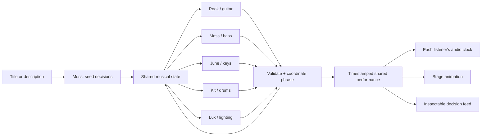

# Architecture and recommended workflow

## Three clocks

1. **Decision clock:** at most one musician plus Lux gets a batched request at each two-bar boundary. Independent 3/4/6-phrase commitments plus 0–1 phrase jitter feed an oldest-due queue. The server starts work 2.3 seconds ahead, permits 1.8 seconds for HTTP, validates responses, and broadcasts a future score frame. The opening call selects the initial musical seed. Musical frames last about 4–6 seconds at prototype tempos; each musician's idea persists across several frames.
2. **Musical clock:** a server timestamp identifies every phrase start. Browsers estimate server offset using request midpoint timing, resync every 30 seconds, and schedule notes with a 25 ms poll / 180 ms Web Audio lookahead. Network calls never trigger individual notes directly. Late notes are skipped rather than burst on reconnect.
3. **Visual clock:** requestAnimationFrame renders the stage (`src/stage/`). `signals.ts` derives every visual input once per frame from committed notes, typed decisions and the soundboard's real meters; performers, light rig, projection wall, crowd, particles and the post chain read only that. The same server-aligned phrase time drives note attack impulses, strumming, drumstick action, piano-key depression, sway and solo energy. OrbitControls supports camera navigation; animation does not consume inference requests.

Timing is suitable for an audience demo, not sample-accurate synchronization between computers. Browser background throttling, output-device latency, and network asymmetry remain real limitations. A mature venue can add an AudioWorklet scheduler and a server-produced streaming mix.



## Jev contract

The OpenRouter route is `POST https://openrouter.ai/api/alpha/decisions`; the pinned prototype model is `typesafe/jev-1.13`. The request uses `state` and named `questions`, each with `type: choice`, `instructions`, and a `criteria` map. Questions in a batch evaluate the same state independently. Eight note-position questions do not autoregressively see each other's new answers.

A persona is a separate request context plus application-maintained history, not a separately provisioned model or permanent provider session. The server owns musical memory. `server/listening.ts` exposes only notes whose onsets are at or before request time minus 180 ms, and clips each note's heard duration to that cutoff. Future frames, future peer notes, and peer decision objects are never included. Four recent heard frames provide context. A musician separately receives its own private motif/role memory. Lux receives only the public heard notes. This is delayed symbolic hearing, not microphone/audio analysis.

## Declarative score

`Frame` contains an ID, future timestamp, duration, BPM, tonic/mode, `Part[]`, lighting, and ending marker. Each part contains its decision, source, solo flag, repeat count, and explicit note events:

```json
{"beat":1.5,"duration":0.34,"midi":62,"velocity":0.6,"hand":"right","patch":"rhodes"}
```

Beats range from 0 through less than 8. No note crosses the phrase boundary. Notes must remain within MIDI 24–96. A phrase contains at most 128 note events per instrument. Keyboard hand assignment is required and overlapping intervals are counted; five left and five right notes are permitted, six in either hand are not. Voicings are compiled from scale degrees, with right-hand durations shortened before subsequent attacks as necessary. Effect release tails can ring after a key is released; finger-count validation concerns held notes.

Twelve rhythmic shapes include lyrical durations/rests, 32nd-note runs (0.125 beat), triplets (1/3), quintuplets (1/5), sextuplets (1/6) and broken syncopation. Swing alters straight offbeats but preserves tuplets. Density thins gestures. Motif development transforms a prior idea by answering, sequencing, inverting or fragmenting it; new_theme explicitly replaces it. Solo voices have more sustain and register contrast, with stepwise short runs. Vary/develop preserves solo status; support/space/rest/resolve ends it. Guitar support adds low double stops. The drum vocabulary includes ghost notes and tuplet fills. This remains a constrained grammar rather than unconstrained composition.

`Part.continued` and `updatedAtFrame` distinguish retained material from a fresh call. Continuing parts copy their exact previous note events (transposed if the group changes key). They keep original provenance. Continuation is not a newly attributed Jev call.

## Recorded voices and local rigs

`public/samples/manifest.json` lists 162 pinned recordings, pitch centers, articulation/dynamic metadata and integrity hashes. `src/samples.ts` decodes locally served MP3 files, normalizes fixed recording gain, selects the nearest sampled pitch and dynamic, and alternates takes. Guitar uses CC0 Karoryfer green hollowbody recordings (pluck/staccato/hammer); bass uses CC0 Karoryfer darkblack fingered recordings. Piano is an attributed CC BY 3.0 tonejs-instruments subset. Drum accents use CC0 VCSL. Missing voices use an explicitly reported synthesis fallback. Organ/Rhodes/synth/pad/bell and kick/mid-tom retain synthesis. No whole phrases are sampled. Bends, slides and vibrato modulate individual guitar sources.

Each player's independent chain is voice/envelope filter → dry + distortion → auto-wah filter → body EQ/cabinet tone → dry + chorus/delay/reverb → ensemble focus → listener fader → stereo pan → meter → master compressor. Tremolo modulates only that player's gain. Every player has distinct nodes, feedback delay and convolver. The sample signal carries its natural recorded envelope; the note gate gives a smooth release.

`shared/mixer.ts` separates local faders/pan/mute/solo from musical decisions. Any listening solo suppresses unsoloed channels; multiple solos are allowed; mute wins. Model effect choices are used in JEV mode, with local ON/OFF overrides. Settings persist locally and never enter the model trace. Automatic accompaniment attenuation is a separate gain stage. The camera and soundboard do not affect other viewers or create inference calls.

## Negotiation and evolution

The selected musician can suggest ease/stay/push. Its impulse changes the next phrase by at most 1.2%, and absolute BPM stays within ±10% of the opening tempo. Other musicians hear the changed tempo before their next decisions. This shares one clock rather than letting instruments drift apart. Swing and accented dynamics add local rhythmic variation.

Two distinct musicians' matching harmony proposals are required to move up a fourth or fifth; proposals expire after six frames. A four-phrase dwell prevents rapid wandering, and accepted modulation clears old proposals. Continuing notes transpose together without changing their rhythmic motif. This shared-key transition and the final landing are deliberate ensemble-wide exceptions to the one-changing-player rule. Players can choose space, sustain, or sparse textures after hearing peers; there is no guarantee that Jev will discover an interesting arc. Listening tests must evaluate that behavior.

Before 300 seconds the ending prompt asks to continue. After that, a linear ending-pressure value rises to 1 at 570 seconds. Two positive model votes can trigger a tonic landing. This is a rising behavioral incentive, not a calibrated mathematical probability of stopping. Independently, the coordinator reserves a final phrase before the 600-second hard stop. Even a failed model or disconnected audience cannot leave the jam running indefinitely. Manual end stops immediately.

## Reliability and evidence

- Validate every expected answer, choice membership, finite probability, and distribution sum. Do not trust an HTTP 200 alone.
- Deadline or provider failure: repeat the last accepted musical idea with provenance `fallback`; if there is no previous idea, rest. Do not accept a late result after the frame deadline.
- Three completely failed rounds stop the jam. A configurable maximum of 1,200 total requests per jam includes failed requests and bootstrap. There is no automatic retry loop.
- Record reported cost when present, even if answer parsing fails. Missing cost stays null; do not call it zero or estimate it silently.
- The trace contains the request, validated answer distribution, optional provider ID, SHA-256 of the request, latency, and application result. It contains no authorization header or key. Hashes make comparison possible but do not independently prove the provider ran the model.
- Memory is bounded to 180 traces and eight score frames. Recent trace export is not a full recording. Closing a tab does not stop the shared room; its timer still does.

## Recommended development workflow

1. **Taste brief:** start with a short scenario and define what good interaction sounds like (call-and-response, restraint, motif continuity, transition quality).
2. **Rehearsal:** deterministic fixtures exercise the renderer, constraints, animation, and transitions without network cost.
3. **Bounded live audition:** use the five-call smoke, then a short host-controlled session. Review decisions alongside audible output; track latency, cost, repetition, density, and solo overlap.
4. **Listening review:** collect specific musical moments, update persona instructions or vocabulary, and record each accepted taste decision in the log. Technical tests cannot certify the music is enjoyable.
5. **Reproducible replay:** next add durable full-session events, seed and version hashes, MIDI/WAV export, and offline rendering. Compare versions on identical traces.
6. **Public venue:** dedicated key, protected hosting, shared broadcast, spectator scale testing, and explicit publish action. Keep one inference stream independent of audience size.
