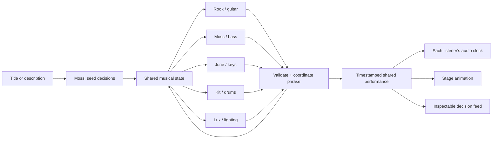

# Architecture and recommended workflow

## Three clocks

1. **Decision clock:** one batched request per active persona per two-bar phrase. The server starts work 2.3 seconds ahead, permits 1.8 seconds for HTTP, validates all responses, and broadcasts a future score frame. The opening call selects the initial musical seed. The musical interval is about 4–6 seconds at prototype tempos.
2. **Musical clock:** a server timestamp identifies every phrase start. Browsers estimate server offset using request midpoint timing, resync every 30 seconds, and schedule notes with a 25 ms poll / 180 ms Web Audio lookahead. Network calls never trigger individual notes directly. Late notes are skipped rather than burst on reconnect.
3. **Visual clock:** requestAnimationFrame renders a stylized stage. Tempo, activity, solo status, and the selected lighting state affect motion. This does not consume inference requests.

Timing is suitable for an audience demo, not sample-accurate synchronization between computers. Browser background throttling, output-device latency, and network asymmetry remain real limitations. A mature venue can add an AudioWorklet scheduler and a server-produced streaming mix.



## Jev contract

The OpenRouter route is `POST https://openrouter.ai/api/alpha/decisions`; the pinned prototype model is `typesafe/jev-1.13`. The request uses `state` and named `questions`, each with `type: choice`, `instructions`, and a `criteria` map. Questions in a batch evaluate the same state independently. Eight note-position questions do not autoregressively see each other's new answers.

A persona is a separate request context plus application-maintained history, not a separately provisioned model or permanent provider session. The server owns all musical memory. On later phrases, each musician sees peer decisions, actual notes, solo status, repetition counts, tempo/key, and four recent frame summaries. Lux observes this same committed score; lights may react one phrase after a new musical gesture, by design.

## Declarative score

`Frame` contains an ID, future timestamp, duration, BPM, tonic/mode, `Part[]`, lighting, and ending marker. Each part contains its decision, source, solo flag, repeat count, and explicit note events:

```json
{"beat":1.5,"duration":0.34,"midi":62,"velocity":0.6,"hand":"right","patch":"rhodes"}
```

Beats range from 0 through less than 8. No note crosses the phrase boundary. Notes must remain within MIDI 24–96. A phrase contains at most 128 note events per instrument. Keyboard hand assignment is required and overlapping intervals are counted; five left and five right notes are permitted, six in either hand are not. Voicings are compiled from scale degrees, with right-hand durations shortened before subsequent attacks as necessary. Effect release tails can ring after a key is released; finger-count validation concerns held notes.

Six rhythmic shapes are compiled to note onsets. Density thins gestures. Soloing increases melodic motion and relative dynamics; support ends a solo. The drum vocabulary compiles a conventional kick/snare/cymbal kit with rhythmic variations and fills. This is a constrained musical grammar, not unconstrained note-by-note composition. All prototype timbres are synthesis, not third-party samples.

## Negotiation and evolution

Each musician can suggest ease/stay/push. Their mean impulse changes the next phrase by at most 1.2%, and absolute BPM stays within ±10% of the opening tempo. This shares one clock rather than letting independent instruments drift apart. Microtiming/swing are a future layer.

Two matching harmony proposals are required to move up a fourth or fifth. A four-phrase dwell prevents rapid wandering. All parts recompile in the accepted key together. Players can choose space, sustained rhythms, or sparse textures in response to peers. Persona instructions request small developments after repetition; there is no guarantee that Jev will discover an interesting musical arc. Listening tests must evaluate that behavior.

Before 300 seconds the ending prompt asks to continue. After that, a linear ending-pressure value rises to 1 at 570 seconds. Two positive model votes can trigger a tonic landing. This is a rising behavioral incentive, not a calibrated mathematical probability of stopping. Independently, the coordinator reserves a final phrase before the 600-second hard stop. Even a failed model or disconnected audience cannot leave the jam running indefinitely. Manual end stops immediately.

## Reliability and evidence

- Validate every expected answer, choice membership, finite probability, and distribution sum. Do not trust an HTTP 200 alone.
- Deadline or provider failure: repeat the last accepted musical idea with provenance `fallback`; if there is no previous idea, rest. Do not accept a late result after the frame deadline.
- Three completely failed rounds stop the jam. A configurable maximum of 1,200 total requests per jam includes failed requests and bootstrap. There is no automatic retry loop.
- Record reported cost when present, even if answer parsing fails. Missing cost stays null; do not call it zero or estimate it silently.
- The trace contains the request, validated answer distribution, optional provider ID, SHA-256 of the request, latency, and application result. It contains no authorization header or key. Hashes make comparison possible but do not independently prove the provider ran the model.
- Memory is bounded to 180 traces and eight score frames. Recent trace export is not a full recording. Closing a tab does not stop the shared room; its timer still does.

## Recommended development workflow

1. **Taste brief:** start with a short scenario and define what good interaction sounds like (call-and-response, restraint, motif continuity, transition quality).
2. **Rehearsal:** deterministic fixtures exercise the renderer, constraints, animation, and transitions without network cost.
3. **Bounded live audition:** use the five-call smoke, then a short host-controlled session. Review decisions alongside audible output; track latency, cost, repetition, density, and solo overlap.
4. **Listening review:** collect specific musical moments, update persona instructions or vocabulary, and record each accepted taste decision in the log. Technical tests cannot certify the music is enjoyable.
5. **Reproducible replay:** next add durable full-session events, seed and version hashes, MIDI/WAV export, and offline rendering. Compare versions on identical traces.
6. **Public venue:** dedicated key, protected hosting, shared broadcast, spectator scale testing, and explicit publish action. Keep one inference stream independent of audience size.
