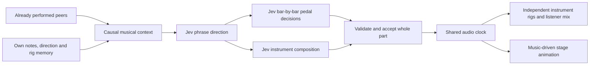

# Musical architecture — groove, phrasing and color

2026-09-19, v0.4. This is the current implementation contract. Earlier prompt and design entries remain historical records.

## Three responsibilities

1. **Musical direction:** style, tension/release arc, tonal center, mode, chord color, playing texture, contour and sonic character. The model sees its own previous direction and motif, and symbolic observations of what peers have already performed. Keeping a groove is a valid choice. The prompt is strongest during the opening; interaction takes over afterward.
2. **Composition and orchestration:** translate the chosen direction into actual note/rest decisions and independent pedal switches. These are Jev requests, not a lookup of complete phrases, voicings or rigs.
3. **Performance:** validate the score, schedule against the audio clock, play samples/synthesis through each instrument's bus, apply the listener's mix, and animate the stage. Rendering does not invent accompaniment or require a network response at the instant a note sounds.

## Style and release

Eight descriptive branches offer pocket funk, soul/gospel, blues rock, jazz funk, psychedelic rock, dub/reggae, Latin fusion and ambient playing. They guide actual composition; they are not song or loop presets. A musician chooses settle, build, peak, release or space and keeps its own direction in memory. After two consecutive build/peak updates, the next plan must choose settle, release or space. This is a guardrail against endless escalation, not a claim that a categorical label guarantees satisfying music.

Jev chooses a diatonic, blues or chromatic vocabulary and a chord quality. Chordal textures offer pitches from that chosen chord; the final attacks of a release also target its chord tones. Jev still chooses the actual MIDI pitches and rhythm. Settled/releasing phrases use more conservative probability sampling and retain the provider's timing choice. Useful rhythmic anchors can recur. Three identical own updates exhaust the hold allowance; waiting through other players' turns does not count. Memory compares actual notes, not the words hold/vary/develop. After three identical own compositions, the next monophonic second attack excludes the old second pitch while keeping the selected palette and opening anchor. Jev chooses the alternate note; the renderer never fabricates a variation.

This replaces the previous blanket demand to avoid reproducing a phrase and the hold restriction tied to global frame count. A stable groove and a changing detail can coexist.

## Instrument capabilities

| Player | Actual model decisions | Constraints/rendering |
|---|---|---|
| Guitar | Single line, double stops, chord comping, strums or swells; exact pitch/mute on each selected string; stroke and spread; single-line bends | Six strings, model-chosen five-fret window; restriking a string releases its earlier held voice |
| Keys | Single line, two-hand chords, split comp/lead, rhythmic stabs or sustained harmony; hand patches, voice counts and exact pitches | Five held notes per hand; a restruck key releases its earlier held voice |
| Bass | Exact sequential pitches, rests, lengths, dynamics, articulations and tonal intention | Bounded bass register; no automatic bassline |
| Drums | Quarter/eighth/triplet/sixteenth pulse, eighth-note swing; kick on/off, snare/tom/rest, cymbal/rest and velocity at every grid position | Two complete bars, at most 64 questions per bar request; second bar sees accepted first-bar hits; no inserted backbeat |

Pitched instruments have up to twelve attacks per two-bar phrase, or eight for keys. Guitar/key attacks can contain many notes. Pitched intervals still include 32nds and tuplets. The drum composer has its own event budget instead of exhausting a melodic attack budget and leaving the second bar empty. Its elected grid is a timing capability, not a stored drum pattern.

Keyboard voice questions are parallel within an attack. Independent answers sometimes selected the same key for every voice. The decoder now samples each hand without replacement from the model's nonzero pitch probabilities. It does not invent a new pitch or choose a canned voicing. If the distribution has no additional supported key, duplicate suppression can still reduce the requested voice count. Raw answers, applied answers and note provenance remain inspectable. This is constrained probability decoding, not a claim that every sounded voice was the provider's top choice.

Recorded percussion rings for its natural sample lifetime even when the score gate is short. Closed hi-hats choke open hats; cymbals can ring across a phrase boundary. Global Stop still fades/stops the performance. Pitched notes retain their selected gate lengths.

## Effects as composition

Each musician first chooses the sonic character of each bar: earthy grit, liquid funk, shimmering width, dub space, pulsing glow, psychedelic surge or an intimate dry contrast. A separate Jev rig request sees this selected intention, the musical plan, the player's old rig and heard peers. It chooses all seven switches for both bars independently: distortion, auto-wah, envelope filter, chorus, tremolo, delay and reverb. The sonic descriptions are guidance, not mappings to fixed pedal combinations. All **128 combinations per bar per instrument** remain available.

`Part.effectsTimeline` records beat 0 and beat 4 cue states with the rig trace ID. The audio clock schedules those cues, including the correct current cue for late listeners. Note-triggered envelope filters use the cue at the note's onset. Continuing parts retain their two-bar score and pedal timeline until that musician's next turn; this is not a fresh model call for every bar of every repeated part.

The desk displays Jev's current ON/OFF selections and marks listener overrides. Manual ON/OFF takes priority; JEV restores automatic control. Mix, solo, level and tone remain local. Each player retains its own effect bus, RMS-matched drive, channel compression and metering. Heard context includes only the effect state that has already become audible, never a future pedal cue or private style plan.

## Preserved contracts

| Contract | Verification |
|---|---|
| Only one musician changes its phrase per boundary | Fair scheduler and ensemble tests; peers retain accepted notes |
| No foreknowledge of peer notes, durations, plans or future effects | 180 ms hearing cutoff and causality tests |
| No fabricated live notes after a request failure | Atomic acceptance, disclosed fallback repeat/rest, failure-stop tests |
| Full polyphony respects physical limits | String and sustained-hand tests, real-call composition audit |
| Pedals are independent and local overrides win | Shared mix tests and real-browser bar-cue/rig tests |
| Percussion tails survive short score gates | Actual browser buffer-source lifetime check |
| Provenance stays honest | Raw/applied answers, note slots, rig trace IDs, visible live/demo mode |
| Stage, lights, mixer and camera survive music changes | Full browser spectator/mixer/camera/trace flow |

The maximum next round reserves 15 calls: plan, rig, twelve attacks and lighting. Drum rounds need only plan, rig and two bar decisions, plus lighting. Deadlines, request caps and the ten-minute hard stop remain. HTTP work stays outside the audio clock.

## Audience workflow and next iterations

Prompt and Play sit above the stage. Play enables audio and loads instruments as part of the same user gesture. A silent spectator joining an existing room sees **Listen to this jam**; an enabled listener sees **Mute sound**. There is no idle Enable sound prerequisite.

Next useful listening targets are whether a motif remains recognizable, whether harmony gives a clear arrival, whether drums/bass leave room for melody, and whether effects create contrast across sections. Future improvements could add phrase trading, longer-term motif callbacks, explicit harmonic progressions, independent phrase lengths and separate per-note timing for the two keyboard hands. None of those are claimed as implemented here. The current phrase clock is still two bars, symbolic hearing is not acoustic perception, and technical checks do not certify taste.
