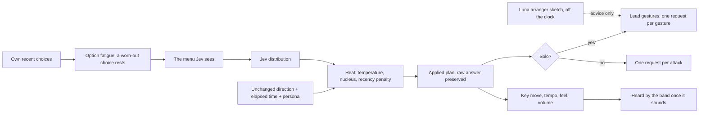
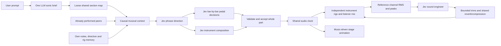

# Musical architecture — groove, phrasing and color

2026-09-20, v0.5 with a v0.7 addendum. This is the current implementation contract. Earlier prompt and design entries remain historical records.

## v0.7 — how the band evolves

Added 2026-09-20. Everything below this section still holds unless stated here.

| Layer | Who decides | Speed | What it gives the music |
|---|---|---|---|
| Arranger sketch (optional) | `gpt-5.6-luna` | 5–20 s, off the clock | A 16-bar solo story: motif, energy arc, landing tones. Advice only |
| Phrase plan | Jev, decoded with fatigue and heat | 1 request | Style, arc, register, texture, mode, keyboards, volume, feel, key move, tempo |
| Lead gesture | Jev | 1 request per gesture, about 300 ms | Runs, cries, cells and riffs with bends, slides, hammer-ons and breaths |
| Groove attack | Jev | 1 request per attack | Exact pitches, chord voices, rests and lengths |
| Rig | Jev | 1 request | Seven pedals per bar; guitar overdrive or lead |

**Why boredom is a harness rule.** Recorded traces showed Jev answering `rhodes 0.94`, `warm 0.99`, `settle 0.9`, `stay 1.00` phrase after phrase. A classifier changes its answer when its state or its options change, so the harness changes those: a choice used too long rests, the request says so, and Jev picks its best alternative. Heat then handles the decisions that are genuinely open (action, register, texture). In a 170-second live run this produced organ, analog, pad, piano and bell alongside Rhodes, three drum feels, four style branches, a player-led move to melodic minor, several guitar and keyboard solos and no fallbacks, where the previous recording held one plan throughout.

**What a solo is now.** A gesture request asks for: `start`, `count`, `grid`, `step1`–`step7`, `landing`, `gap`, `technique`, `ornament`, `shape`, `level`, `next`, and for June `comp` plus three left-hand voices. A live audited guitar chunk: a sextuplet hammer-on run A4–B4–C5–D5 landing on a whole-step bend into F♯5, a second run with a pull-off, then a two-note cry. The previous audit's guitar solo alternated D5 and B4 in quarter notes. The first is from this pass's `audit:solos` run, the second from the previous recorded one; neither is a claim about taste.

**Rendering.** Hammer-ons and pull-offs start the recorded sample past its pick transient with a 14 ms fade. Slides glide from the actual previous pitch. Bends can hold at the target, release, or start pre-bent; vibrato depth is a note property and begins after the bend arrives.

**Known limits.** Harmony is still one tonal center at a time; there are no chord progressions. Accompaniment between a player's turns repeats exactly. Bass and rhythm guitar still compose one attack per request. Option fatigue constants are untuned. The arranger needs an OpenRouter key. A 170-second four-player run made 502 requests and OpenRouter reported $0.49; a full ten-minute jam is therefore on the order of $1.75 at that provider.

## Three responsibilities

1. **Musical direction:** style, tension/release arc, tonal center, mode, chord color, playing texture, contour and sonic character. The model sees its own previous direction and motif, and symbolic observations of what peers have already performed. Keeping a groove is a valid choice. The prompt is strongest during the opening; interaction takes over afterward.
2. **Composition and orchestration:** translate the chosen direction into actual note/rest decisions and independent pedal switches. These are Jev requests, not a lookup of complete phrases, voicings or rigs.
3. **Performance:** validate the score, schedule against the audio clock, play samples/synthesis through each instrument's bus, apply the listener's mix, and animate the stage. Rendering does not invent accompaniment or require a network response at the instant a note sounds.

Before those ongoing responsibilities, one structured LLM request turns the title/description into a specific concept, suggested opening and four to six chronological sections. Every section gives each musician concrete material plus harmonic, style, arc and sound direction. This is an explicitly shared chart, not foreknowledge of a peer's unperformed notes. Only the musician currently taking a composition turn receives the next opportunity to act on it. Jev remains responsible for actual notes and pedals. The chart guides development; it does not guarantee audible semantic fidelity or a particular ending time. After its last section, that direction persists while players continue responding to heard music and their own memory.

The neutral opening request replaces a bass-persona context that biased the opener. The director and Jev opening request see up to four recent openers. June's first composition must include a real Jev-chosen right-hand attack; after two silent own updates she must enter again. Subsequent attacks can still rest. This is an audible-entry capability constraint, not an inserted accompaniment pattern. Failed compositions still use honest fallback behavior. UI distinguishes an intentional breath, a silent accepted phrase and a failed entry.

## Style and release

Eight descriptive branches offer pocket funk, soul/gospel, blues rock, jazz funk, psychedelic rock, dub/reggae, Latin fusion and ambient playing. They guide actual composition; they are not song or loop presets. A musician chooses settle, build, peak, release or space and keeps its own direction in memory. After two consecutive build/peak updates, the next plan must choose settle, release or space. This is a guardrail against endless escalation, not a claim that a categorical label guarantees satisfying music.

Jev chooses a diatonic, blues or chromatic vocabulary and a chord quality. Chordal textures offer pitches from that chosen chord; the final attacks of a release also target its chord tones. Jev still chooses the actual MIDI pitches and rhythm. Settled/releasing phrases use more conservative probability sampling and retain the provider's timing choice. Useful rhythmic anchors can recur. Three identical own updates exhaust the hold allowance; waiting through other players' turns does not count. Memory compares actual notes, not the words hold/vary/develop. After three identical own compositions, the next monophonic second attack excludes the old second pitch while keeping the selected palette and opening anchor. Jev chooses the alternate note; the renderer never fabricates a variation.

This replaces the previous blanket demand to avoid reproducing a phrase and the hold restriction tied to global frame count. A stable groove and a changing detail can coexist.

## Instrument capabilities

| Player | Actual model decisions | Constraints/rendering |
|---|---|---|
| Guitar | Single line, double stops, chord comping, strums or swells; exact pitch/mute on each selected string; stroke and spread; single-line bends | Six strings, model-chosen five-fret window; restriking a string releases its earlier held voice |
| Keys | Single line, two-hand chords, split comp/lead, rhythmic stabs or sustained harmony; hand patches, voice counts and exact pitches | Five held notes per hand; a restruck key releases its earlier held voice |
| Bass | Exact sequential pitches, rests, lengths, dynamics, articulations and tonal intention | Bounded bass register; no automatic bassline |
| Drums | Quarter/eighth/triplet/sixteenth pulse, eighth-note swing; kick on/off, snare/tom/rest, cymbal/rest and velocity at every grid position | Two complete bars, at most 64 questions per bar request; second bar sees accepted first-bar hits; no inserted backbeat |

Pitched instruments have up to twelve attacks per two-bar delivery chunk, or eight for keys. Guitar/key attacks can contain many notes. Pitched intervals still include 32nds and tuplets. The drum composer has its own event budget instead of exhausting a melodic attack budget and leaving the second bar empty. Its elected grid is a timing capability, not a stored drum pattern.

Keyboard voice questions are parallel within an attack. Independent answers sometimes selected the same key for every voice. The decoder now samples each hand without replacement from the model's nonzero pitch probabilities. It does not invent a new pitch or choose a canned voicing. If the distribution has no additional supported key, duplicate suppression can still reduce the requested voice count. Raw answers, applied answers and note provenance remain inspectable. This is constrained probability decoding, not a claim that every sounded voice was the provider's top choice.

Recorded percussion rings for its natural sample lifetime even when the score gate is short. Closed hi-hats choke open hats; cymbals can ring across a phrase boundary. Global Stop still fades/stops the performance. Pitched notes retain their selected gate lengths.

## Effects as composition

Each musician first chooses the sonic character of each bar. Guitar/bass/keys can choose earthy grit, liquid funk, shimmering width, dub space, pulsing glow, psychedelic surge or an intimate dry contrast. Kit chooses natural punch, small room, warm breakbeat, restrained dub space, roomy lift or close dry. A separate Jev rig request sees the chosen intention, musical plan, prior rig and heard peers. Guitar/bass/keys retain seven independently chosen pedals and **128 combinations per bar**. Kit has only saturation, delay and reverb (**eight combinations**), with lower drive/wet/feedback values. Unavailable drum filters, chorus and tremolo are disabled in the model schema, UI and renderer, including stale saved overrides. The sonic descriptions remain guidance, not mappings to fixed pedal combinations. Guitar keeps the boldest coloration; bass uses smaller modulation and wet amounts, and keys use moderate drive with broader shimmer.

`Part.effectsTimeline` records beat 0 and beat 4 cue states with the rig trace ID. The audio clock schedules those cues, including the correct current cue for late listeners. Note-triggered envelope filters use the cue at the note's onset. Continuing parts retain their two-bar score and pedal timeline until that musician's next turn; this is not a fresh model call for every bar of every repeated part.

The desk displays Jev's current ON/OFF selections and marks listener overrides. Manual ON/OFF takes priority; JEV restores automatic control. Mix, solo, level and tone remain local. Each player retains its own effect bus, RMS-matched drive, channel compression and metering. Heard context includes only the effect state that has already become audible, never a future pedal cue or private style plan.

## Preserved contracts

| Contract | Verification |
|---|---|
| One new musical idea per boundary, with concurrent continuation of committed phrases | Fair scheduler, 12-bar continuation tests and simulated live-room tests; explicit user theme transitions can involve all four |
| No foreknowledge of peer notes, durations, plans or future effects | 180 ms hearing cutoff and causality tests |
| No fabricated live notes after a request failure | Atomic acceptance, disclosed fallback repeat/rest, failure-stop tests |
| Full polyphony respects physical limits | String and sustained-hand tests, real-call composition audit |
| Pedals are independent and local overrides win | Shared mix tests and real-browser bar-cue/rig tests |
| Percussion tails survive short score gates | Actual browser buffer-source lifetime check |
| Provenance stays honest | Raw/applied answers, note slots, rig trace IDs, visible live/demo mode |
| Stage, lights, mixer and camera survive music changes | Full browser spectator/mixer/camera/trace flow |

The maximum next round reserves up to 15 calls per selected musician (plan, optional solo plan, rig, twelve attacks), plus lighting and Patch when due. Actual drum rounds use fewer calls. Concurrent composition increases the default request cap to 6,000; a lower configured cap remains authoritative. Deadlines and the ten-minute hard stop remain. HTTP work stays outside the audio clock. Each theme's director call is separately reported and bounded to 25 seconds; no automatic retries.

## Independent phrases, solos and transitions

Each player independently chooses 2/4/6/8/12 bars using Jev probabilities and the current mood. A long phrase keeps its opening motif, style and tonal direction while Jev writes a fresh two-bar continuation at every boundary. Continuations can develop or vary; they cannot hold the entire old chunk or declare a new theme midway through the commitment. All active continuations compose in parallel from frozen, already-heard peer state. The fair rotation admits one new idea alongside them. The two-bar unit is the delivery/deadline size, not the maximum musical sentence.

Guitar and keyboard solos have a dedicated Jev composition mode, with a probabilistically chosen 8/10/12/16/20/24/28/32-bar journey. Each fresh chunk sees its statement/development/resolution stage, first motif and last notes. Lead note choices exclude selected old pitches and intervals, avoid a third identical onset interval when alternatives exist, and span both bars. Guitar leads are single lines; keys may retain left-hand comping. Earlier lead gates end at the next attack. The app constrains capabilities but never fills in a prewritten solo. A failed solo chunk falls silent and clears solo status rather than presenting a repeated accompaniment as a solo.

Solo invitations grow more urgent with elapsed time. After about 175 seconds without a new solo, the next eligible opportunity requests one from guitar or keys, alternating the last invited role, provided at least eight bars fit before the hard stop. Network availability and chosen duration still affect what becomes audible. Multiple simultaneous soloists remain allowed; listener mixer solo is separate.

**Superseded 2026-09-20:** a queued song now cues a natural wind-down to silence and then starts from nothing through the first-song path; see the decision log entry "A queued song is a new song". The remainder of this paragraph describes the earlier behavior. A follow-up prompt queues a new theme, with an eight-bar lead-in from the next two-bar boundary. Up to four themes may wait. A separately labeled `openai/gpt-5.6-luna` brief supplies the next concept; failure or late completion leaves the raw prompt usable. At the target boundary, all four musicians reset old phrase/solo commitments and compose toward the theme while retaining causal hearing. Queueing does not reset the ten-minute lifetime or API budget. The UI reports phrase/solo bar progress and each of June's hand patches.

## Global sound and manual control

The reference browser accumulates actual channel RMS and peak measurements after instrument effects/channel compression, before Patch's trims and listening faders, mute, solo, pan and master. Every 2.5 seconds it submits four pairs of numbers, never audio. Its local pedal/tone settings may color this reference. Starting the room elects that browser locally; the host can explicitly select another. Only one reference browser should be used: this prototype has no server-enforced reference lease. Viewer count never creates additional Jev calls.

On alternate phrase rounds, fresh measurements (under ten seconds old) allow one Patch Jev request alongside composition and lighting. Patch hears already-performed context, sees current trims and may move each instrument by -1/0/+1 dB, within ±6 dB total. Silent channels below -55 dB RMS cannot be adjusted, and already-hot channels cannot be boosted. Room reverb is capped at 22%, threshold at -20 to -6 dB and ratio at 1.5:1 to 4:1. These are explicit conservative application bounds. Failed/late requests or absent fresh meters retain the prior mix.

Accepted mixes carry their trace and measurement time in each frame. The audio clock applies smooth trims plus a shared parallel reverb and glue compressor before the existing protected master. The local master desk can bypass all Jev trims and use manual reverb/threshold/ratio; channel faders remain available. Switching manually cancels pending master automation. Saved manual settings are range-validated. A manual listener does not change the shared server mix for other viewers.

## Audience sound and listening workflow

The crowd has its own quiet bus into the master mix. Patch chooses listening/grooving/quiet/applause/cheering and attenuation in its existing decision call, based on performed music. Listener controls provide mute, reactions, manual mood and level. Crossfaded beds and spaced reactions use a reviewed local sample bank when available; the current bank is empty, so the UI honestly labels procedural room noise and soft applause. The bounded ElevenLabs generation adapter can prepare up to 100 clips with hashes, prompts, license descriptions and explicit review flags. See [Audience sound](AUDIENCE.md) for research, generation and verification details.

Prompt and Play sit above the stage. Play enables audio and loads instruments as part of the same user gesture. A silent spectator joining an existing room sees **Listen to this jam**; an enabled listener sees **Mute sound**. There is no idle Enable sound prerequisite.

Next useful listening targets are whether a motif remains recognizable, whether harmony gives a clear arrival, whether drums/bass leave room for melody, and whether effects create contrast across sections. Future improvements could add phrase trading, longer-term motif callbacks, explicit harmonic progressions and separate per-note timing for the two keyboard hands. These are not claimed as implemented. The delivery clock is still two bars, symbolic hearing is not acoustic perception, and technical checks do not certify taste.
